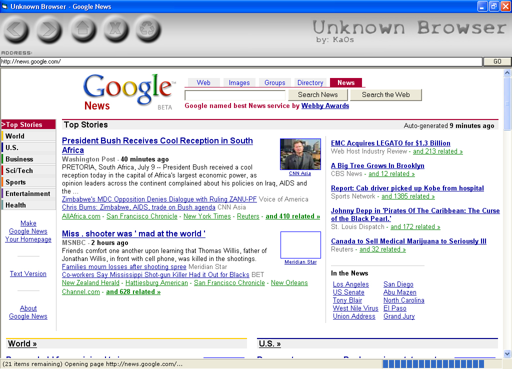



## Advanced, Highly graphical web browser\.

### Description

Shows how to create a web browser using a progress bar, showing the title of the page in the title of the app, keeping objects sized according to the forms size, much more. PLEASE BE EASY ON ME, THIS IS MY FIRST SUBMISSION :D
 
### More Info
 
Can get pretty complicated for a n00b.

             |
---                |---
**Submitted On**   |2003-07-04 11:06:00
**By**             |[KaOs \- KaoticElites\.com](https://github.com/Planet-Source-Code/PSCIndex/blob/master/ByAuthor/kaos-kaoticelites-com.md)
**Level**          |Intermediate
**User Rating**    |5.0 (15 globes from 3 users)
**Compatibility**  |VB 6\.0
**Category**       |[Internet/ HTML](https://github.com/Planet-Source-Code/PSCIndex/blob/master/ByCategory/internet-html__1-34.md)
**World**          |[Visual Basic](https://github.com/Planet-Source-Code/PSCIndex/blob/master/ByWorld/visual-basic.md)
**Archive File**   |[Advanced\_\_161215792003\.zip](https://github.com/Planet-Source-Code/kaos-kaoticelites-com-advanced-highly-graphical-web-browser__1-46777/archive/master.zip)

